# Assignment 4

# Team Members

### Harshit Aggarwal (2021111015)

### Bhav Beri (2021111013)

This assignment was developed and tested in - Ansi C Language.

----

## First Come First Serve (FCFS)

-   We need to store the creation time of every process so, we add the ctime variable to the struct proc.
-   In the scheduler function, we change the sheduler to FCFS by first going through all the processes and picking the process with the minimum creation time(ticks).
-   Then we just run the process by calling the swtch call.

## Lotery Based Scheduling (LBS)

-   We need to first add the number of tickets for every process in the struct proc. So, we define a new variable named tickets for the same.
-   Then for changing the tickets, we make a system call named settickets by adding the system call to the sysproc.c and adding it to rest of the places.
-   Now, we make changes in the scheduler function and start implementing LBS. For, the same, we first go through all the processes and find the total number of processes and also the total number of tickets for all the proceses.
-   Then we generate a random number using rand.c between 0 and total number of tickets. We use this random number to find which process is selected for running. Any random number between the sum of tickets of the processes before the process and sum of tickets of all the processes before this process plus tickets for this process will result in choosing this process.
-   Now, we just run this process.

## Priority Based Scheduling (PBS)

-   We need to first add a few variables to the struct proc to maintain the priority. For the same, we define number of times scheduled which captures the number of times the process was scheduled before, static proirity which contains the static priority for the process, sleep start which contain the starting time when the process sleeps, sleeping ticks which contains the amount of ticks the process spent while sleeping, running ticks which contains the amount of ticks process spent running, reset niceness which is one if the niceness was reset to 5 and otherwise 0.
-   Now we implement a user call which is used by the user to change the priority of a process. We make a system call for the same and also make the user call for that system call. The function basically focuses on changing the static priority of the process and reseting the niceness by making reset priority equal to 1.
-   We also need to make changes in sleep as we store the time when process starts to sleep there.
-   We also make changed in wakeup as we add the time for which the process slept to sleeing ticks.
-   We make changes in trap.c which increases the running ticks of the running process whenever it increases the ticks.
-   Now we make chnages in the scheduler function. We loop on all of the processes and try to find the process to run next. We make the decision on the basis of which process has higher dynamic priority which we calculate using the formulas described in the assignment pdf. In case of tie, we check the number of times the process was called earlier. In case of tie again, we use their creation time to break the tie.
-   At the last, we just run the process we chose.

## Multi Level Feedback Queue (MLFQ)

-   We first add some variables to the struct proc. We define level which contains the queue number of the process, in queue which is 1 if the process belongs to the queu and otherwise 0, change queue which contains the number of ticks after which the process should be preempted and taken to the next queue, enter ticks which contains the information about when the process entered a particular queue.
-   We start with making changes in the scheduler function. We first loop through all the processes and check if the process is aged and we need to take it to a higher queue. For the same, we delete the process from all the queues and then change in queue variable to 0 and decrement the level by 1 if it is not already 0.
-   Now, we again loop through all the processes to see if there is any process we need to push inside the queue. So, we push those processes in the queue corresponding to the level of that process.
-   Now, we start looping through all the queues starting from the highest queue and if we find a runnable process, we select that process for running the next.
-   Now, we just run the chosen process.
-   We also make changes in the trap.c file. We check if the process is aged. If yes, we preempt the process and take that process to the next queue.
-   Also, we add 2 parameters to param.c i.e. number of queues which is 5 in our case and ageing time which is 30 ticks in our case.
-   Also, for implementing the queue, we make a new struct and define it in the proc.h itself. We implement all the commands of the queue like popfront, pushback, front, size and delete in a new file named queue.c.

----

## Observation

## Round Robin (RR) `[CPUS=2]`

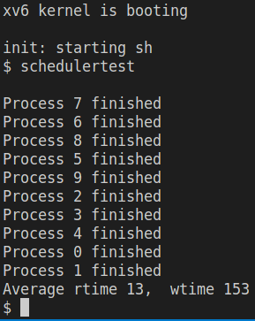 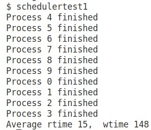

## First Come First Serve (FCFS) `[CPUS=2]`

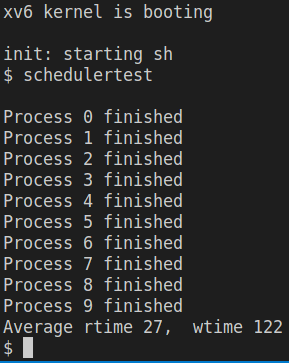 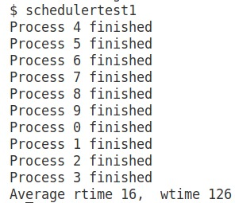

## Lotery Based Scheduling (LBS) `[CPUS=2]`

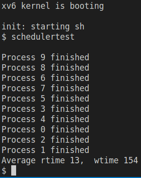 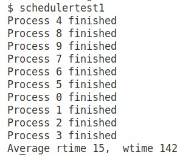

## Priority Based Scheduling (PBS) `[CPUS=2]`

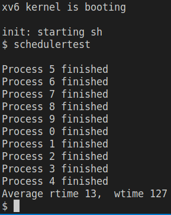 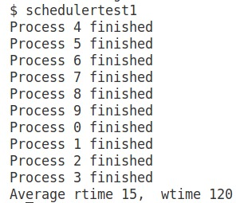

## Multi Level Feedback Queue (MLFQ) `[CPUS=1]`

 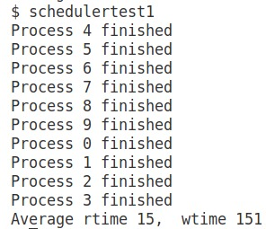
-----

## Scheduling Analysis

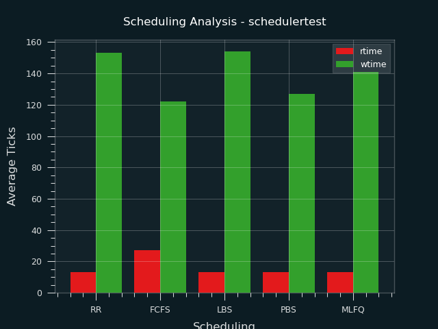 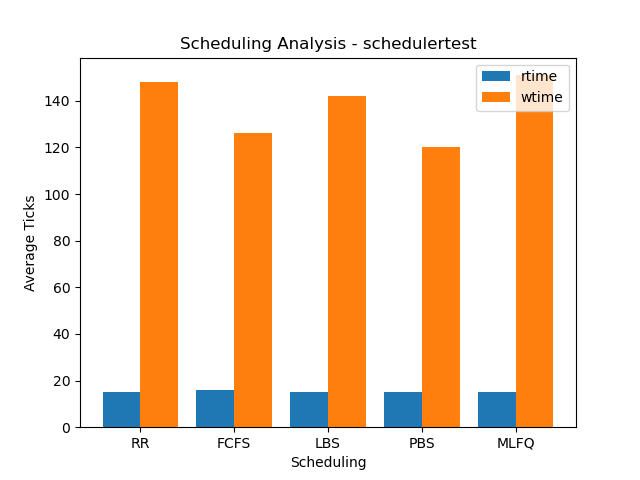

### Overall Comparison -> `FCFS ~ PBS > LBS > RR > MLFQ`
---